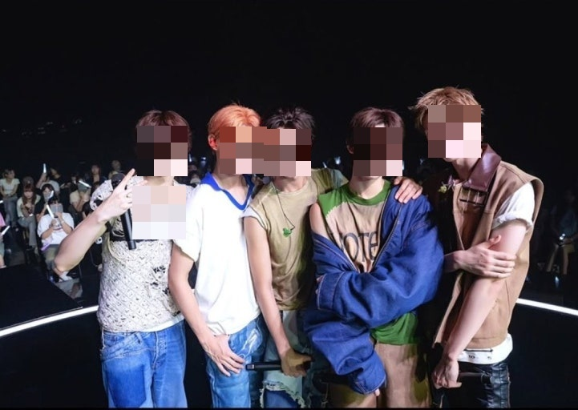

# 🎭 Face Mosaic Generator (자동 얼굴 모자이크 변환기)

## 1. Project Overview (프로젝트 개요)
이 프로젝트는 **Open Source SW** 수업의 텀 프로젝트로, OpenCV를 활용하여 이미지 내의 사람 얼굴이나 특정 영역을 자동으로 감지하고, 해당 부분을 모자이크 처리하여 익명성을 보호해주는 프로그램입니다.

- 주요 기능: 이미지 불러오기, 얼굴/영역 감지, 모자이크 필터 적용, 결과 저장

- 개발 목적: 사진 속 초상권 보호 및 이미지 처리 알고리즘 학습

## 2. Demo (실행 예시)
원본 사진 속 얼굴을 자동으로 인식하여 Mosaic 처리를 수행합니다.

| Original Image | Mosaic Result |
|:---:|:---:|
|  |  |


## 3. Requirements (설치 및 환경)
이 프로젝트는 Python 3.x 환경에서 동작하며, 아래 패키지 설치가 필요합니다.

* **OS:** Windows / Mac / Linux
* **Language:** Python 3.8+
* **Library:** OpenCV (`opencv-python`), NumPy

### 설치 방법
터미널(CMD)에서 아래 명령어를 입력하세요.
```bash
pip install opencv-python numpy
```

## 4. How to Run (실행 방법)
1. 이 저장소를 로컬 컴퓨터로 클론(Clone)합니다.
2. data 폴더에 처리할 이미지를 저장합니다.
3. 아래 명령어로 파이썬 스크립트를 실행합니다.
```bash
python main.py
```
4. 실행이 완료되면 output 폴더에 파일명_mosaic.jpg 파일이 생성됩니다.

## 5. References (참고자료)
이 프로젝트를 개발하면서 참고한 자료입니다.

OpenCV 공식 문서: [https://docs.opencv.org/](https://docs.opencv.org/4.x/)

관련 블로그: https://blog.naver.com/only4clovers/223778393217
